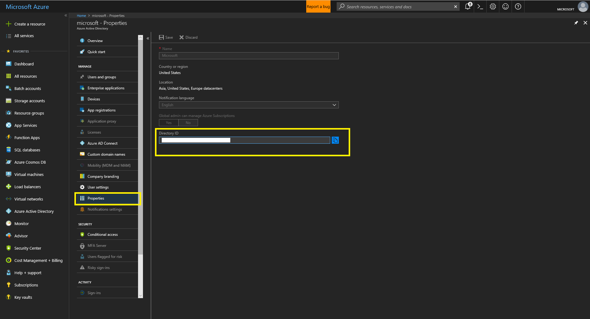
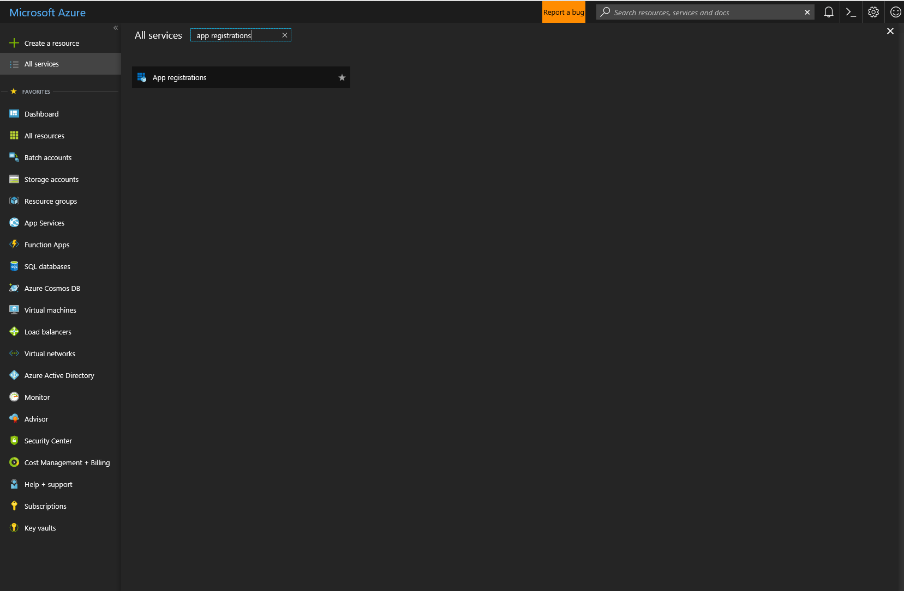
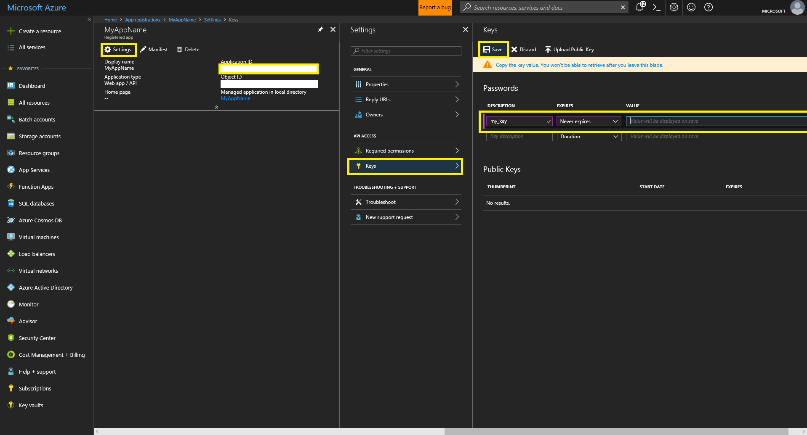

# Azure Distributed Data Engineering Toolkit
The Azure Distributed Data Engineering Toolkit is a project that allows Sparks users to easily spin up a Spark cluster in Azure.

## Getting Started
The minimum requirements to get started with this package are:
- Python 3.5+, pip 9.0.1+
- An Azure account
- An Azure Batch account
- An Azure Storage account

### Cloning and installing the project
1. Clone the repo
2. Make sure you are running python 3.5 or greater.
    _If the default version on your machine is python 2 make sure to run the following commands with **pip3** instead of **pip**._

3. Install `aztk`:
    ```
    pip install -e .
    ```
5. Initialize your environment:

    Navigate to the directory you wish to use as your spark development environment, and run:
    ```bash
    aztk spark init
    ```
    This will create a *.aztk* folder with preset configuration files in your current working directory.

    If you would like to initialize your AZTK clusters with a specific development toolset, please pass one of the following flags:
    ```bash
    aztk spark init --python
    aztk spark init --R
    aztk spark init --scala
    aztk spark init --java
    ```

    If you wish to have global configuration files that will be read regardless of your current working directory, run:
    ```bash
    aztk spark init --global
    ```
    This will put default configuration files in your home directory, *~/*. Please note that configuration files in your current working directory will take precident over global configuration files in your home directory.


### Setting up your accounts

#### Using the account setup script
A script to create and configure the Azure resources required to use `aztk` is provided. For more more information and usage, see [Getting Started Script](./01-getting-started-script.md).

#### Manual resource creation
To finish setting up, you need to fill out your Azure Batch and Azure Storage secrets in *.aztk/secrets.yaml*. We'd also recommend that you enter SSH key info in this file too.

Please note that if you use ssh keys and a have a non-standard ssh key file name or path, you will need to specify the location of your ssh public and private keys. To do so, set them as shown below:
```yaml
default:
    # SSH keys used to create a user and connect to a server.
    # The public key can either be the public key itself(ssh-rsa ...) or the path to the ssh key.
    # The private key must be the path to the key.
    ssh_pub_key: ~/.ssh/my-public-key.pub
    ssh_priv_key: ~/.ssh/my-private-key
```

0. Log into Azure
If you do not already have an Azure account, go to [https://azure.microsoft.com/](https://azure.microsoft.com/) to get started for free today.

    Once you have one, simply log in and go to the [Azure Portal](https://portal.azure.com) to start creating your Azure Batch account and Azure Storage account.


##### Using AAD
To get the required keys for your Azure Active Directory (AAD) Service Principal, Azure Batch Account and Azure Storage Account, please follow these instructions. Note that this is the recommended path for use with AZTK, as some features require AAD and are disabled if using Shared Key authentication.

1. Register an Azure Active Directory (AAD) Application

- Navigate to Azure Active Direcotry by searching in "All Services". Click "Properties" and record the value in the "Directory ID" field. This is your __tenant ID__.



- Navigate to App Registrations by searching in "All Services".



- Click the "+ New application registration" option at the top left of the window. Fill in the necessary fields for the "Create" form. For "Application type" use "Web app/ API."


- Click on the newly created App to reveal more info. Record the Application ID (for use as Client ID). Then click "Settings", then "Keys." Create a new password using the provided form, ensure to copy and save the password as it will only be revealed once. This password is used as the __credential__ in secrets.yaml.



2. Create a Storage Account

- Click the '+' button at the top left of the screen and search for 'Storage'. Select 'Storage account - blob, file, table, queue' and click 'Create'


- Fill in the form and create the Storage account.


- Record the Storage account's resource ID.


- Give your AAD App "Contributor" permissions to your Batch Account. Click "Access Control (IAM)", then "+ Add" at the top left. Fill in the "Add Permissions" form and save.


3. Create a Batch Acccount

- Click the '+' button at the top left of the screen and search for 'Compute'. Select 'Batch' and click 'Create'


- Fill in the form and create the Batch account.


- Navigate to your newly created Batch Account and record it's resource ID by clicking "Properties" and copying.


- Give your AAD App "Contributor" permissions to your Batch Account. Click "Access Control (IAM)", then "+ Add" at the top left. Fill in the "Add Permissions" form and save.


4. Save your account credentials into the secrets.yaml file

- Open the secrets.yaml file in the *.aztk* folder in your current working directory (if *.aztk* doesn't exist, run `aztk spark init`). Fill in all of the fields as described below.

- Fill in the Service princripal block with your recorded values as shown below:
```
service_principal:
    tenant_id: <AAD Diretory ID>
    client_id: <AAD App Application ID>
    credential: <AAD App Password>
    batch_account_resource_id: </batch/account/resource/id>
    storage_account_resource_id: </storage/account/resource/id>
```

#### Using Shared Keys
_Please note that using Shared Keys prevents the use of certain AZTK features including Mixed Mode clusters and support for VNETs._

To get the required keys for Azure Batch and Azure Storage, please follow the below instructions:

1. Create a Storage account

- Click the '+' button at the top left of the screen and search for 'Storage'. Select 'Storage account - blob, file, table, queue' and click 'Create'


- Fill in the form and create the Storage account.


2. Create a Batch account

- Click the '+' button at the top left of the screen and search for 'Compute'. Select 'Batch' and click 'Create'


- Fill in the form and create the Batch account.


4. Save your account credentials into the secrets.yaml file

- Open the secrets.yaml file in the *.aztk* folder in your current working directory (if *.aztk* doesn't exist, run `aztk spark init`). Fill in all of the fields as described below.

- Go to the accounts in the Azure portal and copy pase the account names, keys and other information needed into the
secrets file.

#### Storage account

For the Storage account, copy the name and one of the two keys:


#### Batch account

For the Batch account, copy the name, the url and one of the two keys:


## Next Steps
- [Create a cluster](./10-clusters.md)
- [Run a Spark job](./20-spark-submit.md)
