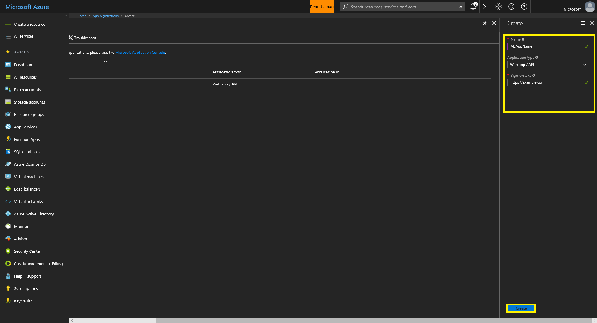
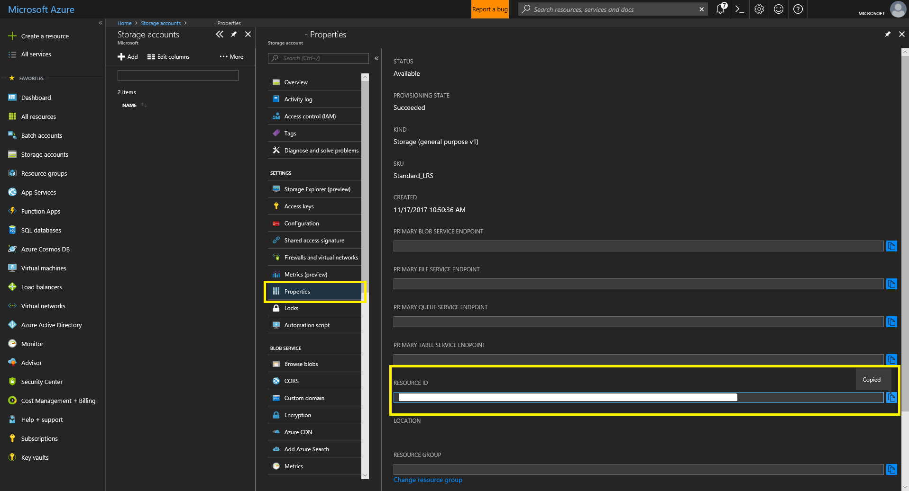
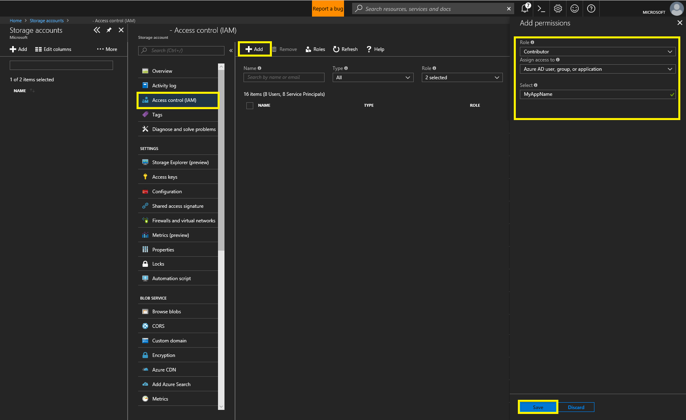
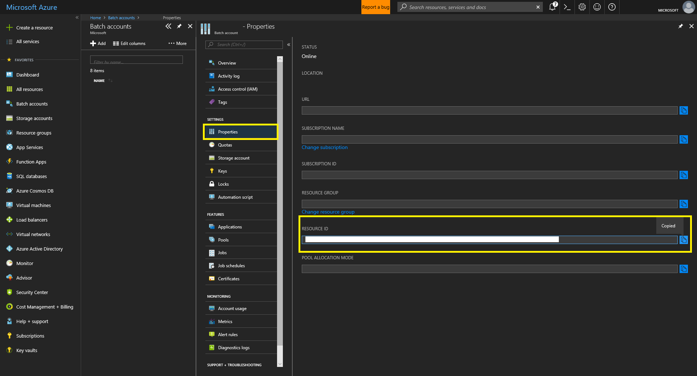
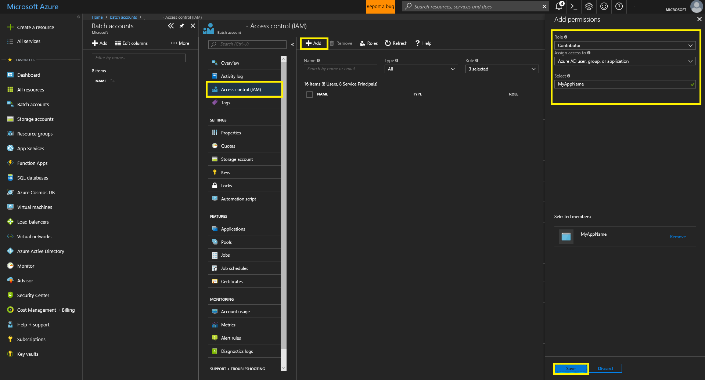

# Getting Started
The minimum requirements to get started with this package are:
- Python 3.5+, pip 9.0.1+
- An Azure account

## Installation
Before you start, ensure you are running python 3.5 or greater by running: `python --version`.

### Install from pip
The latest release of aztk is distributed through `pip`. To install, run:
```sh
pip install aztk
```

### Install from source
1. Clone the repo
    ```sh
    git clone https://github.com/Azure/aztk.git
    ```
2. Install `aztk`:
    ```sh
    pip install -e .
    ```
### Initialize your environment
Navigate to the directory you wish to use as your spark development environment, and run:
```sh
aztk spark init
```
This will create a *.aztk* folder with preset configuration files in your current working directory.

If you would like to initialize your AZTK clusters with a specific development toolset, please pass one of the following flags:
```bash
aztk spark init --python
aztk spark init --R
aztk spark init --scala
aztk spark init --java
```

If you wish to have global configuration files that will be read regardless of your current working directory, run:
```bash
aztk spark init --global
```
This will put default configuration files in your home directory, *~/*. Please note that configuration files in your current working directory will take precedence over global configuration files in your home directory.

## Account Setup

To create the necessary Azure Resources, either:
1. [Run the provided account setup script.](#account-setup-script)
2. [Create the resources manually.](#manual-resource-creation)

### Account Setup Script
#### Overview
The account setup script creates and configures all of the required Azure resources.

The script will create and configure the following resources:
- Resource group
- Storage account
- Batch account
- Azure Active Directory application and service principal
<!-- - Virtual network with a configured subnet -->

The script outputs all of the necessary information to use `aztk`, copy the output into the `.aztk/secrets.yaml` file created when running `aztk spark init`.

#### Usage
Copy and paste the following into an [Azure Cloud Shell](https://shell.azure.com):
```sh
wget -q https://raw.githubusercontent.com/Azure/aztk/v0.8.1/account_setup.sh &&
chmod 755 account_setup.sh &&
/bin/bash account_setup.sh
```
A series of prompts will appear, and you can set the values you desire for each field. Default values appear in brackets `[]` and will be used if no value is provided.
```
Azure Region [westus]:
Resource Group Name [aztk]:
Storage Account Name [aztkstorage]:
Batch Account Name [aztkbatch]:
Active Directory Application Name [aztkapplication]:
Active Directory Application Credential Name [aztk]:
```

Once the script has finished running you will see the following output:

```
service_principal:
    tenant_id: <AAD Diretory ID>
    client_id: <AAD App Application ID>
    credential: <AAD App Password>
    batch_account_resource_id: </batch/account/resource/id>
    storage_account_resource_id: </storage/account/resource/id>
```

Copy the entire `service_principal` section in your `.aztk/secrets.yaml`. If you do not have a `secrets.yaml` file, you can create one in your current working directory by running `aztk spark init`.

Now you are ready to create your first `aztk` cluster. See [Creating a Cluster](./10-clusters.html#creating-a-cluster).

### Manual resource creation
To finish setting up, you need to fill out your Azure Batch and Azure Storage secrets in *.aztk/secrets.yaml*. We'd also recommend that you enter SSH key info in this file too.

Please note that if you use ssh keys and a have a non-standard ssh key file name or path, you will need to specify the location of your ssh public and private keys. To do so, set them as shown below:
```yaml
# SSH keys used to create a user and connect to a server.
# The public key can either be the public key itself(ssh-rsa ...) or the path to the ssh key.
# The private key must be the path to the key.
ssh_pub_key: ~/.ssh/my-public-key.pub
ssh_priv_key: ~/.ssh/my-private-key
```

#### Log into Azure
If you do not already have an Azure account, go to [https://azure.microsoft.com](https://azure.microsoft.com) and create an account.

Once you have one, log in and go to the [Azure Portal](https://portal.azure.com) to create your Azure Batch account and Azure Storage account.

#### Using Azure Active Directory Authentication
To get the required keys for your Azure Active Directory (AAD) Service Principal, Azure Batch Account and Azure Storage Account, please follow these instructions. Note that this is the recommended path for use with AZTK, as some features require AAD and are disabled if using the alternative Shared Key authentication.

1. Register an Azure Active Directory (AAD) Application

- Navigate to Azure Active Directory by searching in "All Services". Click "Properties" and record the value in the "Directory ID" field. This is your __tenant ID__.


- Navigate to App Registrations by searching in "All Services".


- Click the "+ New application registration" option at the top left of the window. Fill in the necessary fields for the "Create" form. For "Application type" use "Web app/ API."



- Click on the newly created App to reveal more info. Record the Application ID (for use as Client ID). Then click "Settings", then "Keys." Create a new password using the provided form, ensure to copy and save the password as it will only be revealed once. This password is used as the __credential__ in secrets.yaml.


2. Create a Storage Account

- Click the '+' button at the top left of the screen and search for 'Storage'. Select 'Storage account - blob, file, table, queue' and click 'Create'


- Fill in the form and create the Storage account.


- Record the Storage account's resource ID.



- Give your AAD App "Contributor" permissions to your Batch Account. Click "Access Control (IAM)", then "+ Add" at the top left. Fill in the "Add Permissions" form and save.



3. Create a Batch Account

- Click the '+' button at the top left of the screen and search for 'Compute'. Select 'Batch' and click 'Create'


- Fill in the form and create the Batch account.


- Navigate to your newly created Batch Account and record it's resource ID by clicking "Properties" and copying.



- Give your AAD App "Contributor" permissions to your Batch Account. Click "Access Control (IAM)", then "+ Add" at the top left. Fill in the "Add Permissions" form and save.



4. Save your account credentials into the secrets.yaml file

- Open the secrets.yaml file in the *.aztk* folder in your current working directory (if *.aztk* doesn't exist, run `aztk spark init`). Fill in all of the fields as described below.

- Fill in the service_principal block with your recorded values as shown below:
```
service_principal:
    tenant_id: <AAD Diretory ID>
    client_id: <AAD App Application ID>
    credential: <AAD App Password>
    batch_account_resource_id: </batch/account/resource/id>
    storage_account_resource_id: </storage/account/resource/id>
```

#### Using Shared Key Authentication
Please note that using Shared Keys prevents the use of certain AZTK features including low priority nodes and VNET support. It is reccomended to use [Azure Active Directory (AAD) Authentication](#using-azure-active-directory-authentication).

To get the required keys for Azure Batch and Azure Storage, please follow the below instructions:

##### Create a Storage account

- Click the '+' button at the top left of the screen and search for 'Storage'. Select 'Storage account - blob, file, table, queue' and click 'Create'


- Fill in the form and create the Storage account.


##### Create a Batch account

- Click the '+' button at the top left of the screen and search for 'Compute'. Select 'Batch' and click 'Create'


- Fill in the form and create the Batch account.


##### Save your account credentials into the secrets.yaml file

Open the `.aztk/secrets.yaml` file in your current working directory (if `.aztk/` doesn't exist, [initialize your environment](#initialize-your-environment). Fill in all of the fields as described below.

For the Storage account, copy the name and one of the two keys:


For the Batch account, copy the name, the url and one of the two keys:


## Next Steps
- [Create a cluster](10-clusters.html)
- [Run a Spark job](./20-spark-submit.html)
